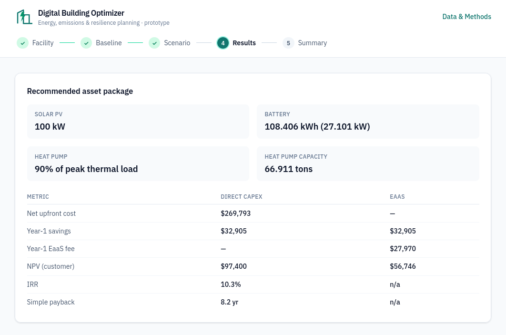

# Digital Building Optimizer

**Describe any commercial building in three inputs. Get a decarbonization plan you can act on.**

**Try it live:** [digital-building-optimizer-dbo.vercel.app](https://digital-building-optimizer-dbo.vercel.app)



Enter a ZIP code, building type, and floor area. The app builds your energy and emissions baseline, sizes solar, batteries, and heat pumps for your building, tells you what the package costs and saves, scores your climate risk, and exports a report you can hand to a stakeholder. A professional energy audit costs five figures and weeks of lead time. This gets you a credible first answer in five minutes, free.

## Who it's for

**Small and mid-sized companies first.** Most SMEs know they should be doing something about energy costs and emissions, but a comprehensive audit is a big-ticket engagement: specialist consultants, weeks of metering and modeling, five-figure fees. So the topic stays on the "someday" list. This app moves "someday" to today: enter three facts about your building and walk away with a baseline, an asset recommendation, a financing comparison, and a PDF you can put in front of your bank, landlord, or board, free and in one sitting.

Energy consultants and corporate sustainability teams get value from it too: a fast screening step that makes the eventual detailed audit narrower, cheaper, and faster.

One caveat: this is a prototype. Outputs are directionally correct, not investment-grade. Treat it as the tool that starts the decarbonization conversation and scopes the real audit.

## How it works

You walk five screens:

1. **Facility** — ZIP, building type, size, construction vintage
2. **Baseline** — what the building consumes and emits today, and what it costs, month by month
3. **Goal** — maximize financial return, or hit a CO₂ reduction target; choose which assets are on the table
4. **Results** — recommended system sizes, hourly dispatch, CapEx vs. Energy-as-a-Service financing compared on NPV and payback, and climate hazard exposure before and after
5. **Summary** — the recommendation in plain language, plus a PDF report explaining why each asset was chosen and a CSV of the underlying numbers

## Why trust it

Nothing in the app is a black box. Every input traces to a named public source: Census for geography, CBECS for building energy benchmarks, EIA and eGRID for tariffs and grid carbon, FEMA's National Risk Index for hazard scores. The optimization is a transparent hourly linear program, and the **Data & Methods** page inside the app documents each source and its limits.

One caveat: weather and solar profiles are synthetic approximations, not measured data. The app labels this everywhere it matters.

## Under the hood

Three services, one data flow:

```
┌──────────────────┐     ┌─────────────────────┐     ┌──────────────────┐
│  Frontend        │     │  Backend API        │     │  Reference data  │
│  Next.js wizard  │────▶│  FastAPI            │────▶│  committed files │
│  charts + PDF   ◀│─────│  baseline / optimize│     │  backend/data/   │
└──────────────────┘     │  / resilience       │     └──────────────────┘
                         └──────────┬──────────┘
                                    │
                         ┌──────────▼──────────┐
                         │  Engine             │
                         │  hourly dispatch LP │
                         │  + DCF financing    │
                         └─────────────────────┘
```

The wizard sends three facility inputs plus a scenario. The API resolves the location to climate zone, tariffs, and grid carbon from committed datasets, then the engine dispatches candidate asset systems hour by hour and prices each one. The frontend renders results and generates the PDF report locally.

## Running it

Backend (Python):

    pip install -r backend/requirements.txt
    uvicorn app.main:create_app --factory --reload --port 8000   # from backend/

Frontend (Node 18+):

    cd frontend
    npm install
    cp .env.local.example .env.local
    npm run dev                        # http://localhost:3000

No backend handy? Set `NEXT_PUBLIC_USE_MOCKS=1` in `.env.local` and the wizard runs offline against committed fixtures. Pipeline scripts in `data_pipeline/` rebuild each dataset from its public source. `./scripts/smoke_demo.sh` checks the API end to end.

Tests: `npm test` (unit) and `npm run e2e` (browser, needs `npx playwright install chromium` once). The raw API is documented by example in `scripts/smoke_demo.sh`.

## Deploying

The app deploys free on two services:

- **Backend on Render**: New → Blueprint → select this repo. The `render.yaml` at the root defines the service (Python, health check `/api/v1/health`). After the frontend exists, set `CORS_ORIGINS` to the frontend URL (comma-separated) and redeploy.
- **Frontend on Vercel**: import the repo, set Root Directory to `frontend`, and add `NEXT_PUBLIC_API_BASE` pointing at the Render URL. Leave `NEXT_PUBLIC_USE_MOCKS` unset for a live demo.

Free-tier note: the Render service sleeps after 15 minutes idle, so the first visitor waits about a minute for it to wake.

---

Built by **Raka Adrianto**, Sustainability PM.
